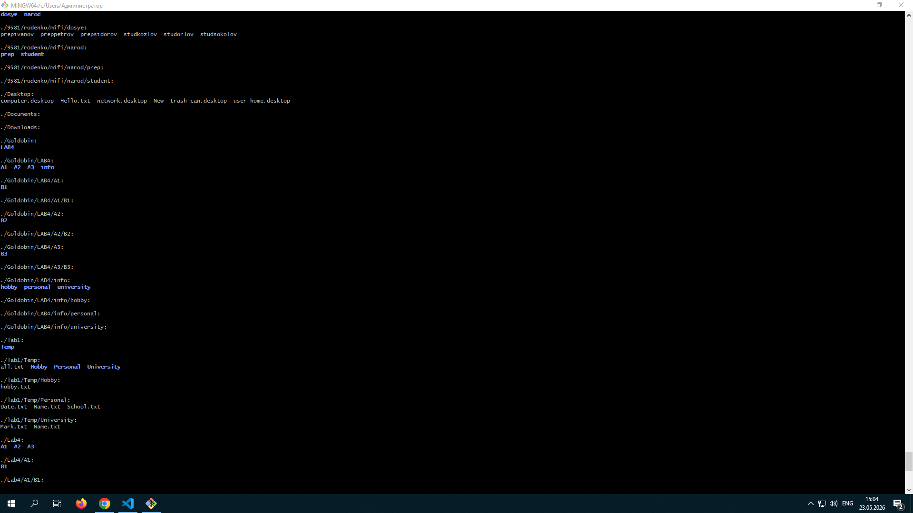

# Работа с командной строкой Linux

## Анализ выполненных команд

Скриншоты:

- 
- 

### Основные выполненные команды

| **Команда** | **Описание** |
|---|---|
| `ls -r` | Вывод списка файлов в обратном порядке |
| `ls ~/.ssh` | Просмотр содержимого директории SSH |
| `ssh user@192.168.129.150` | Подключение к удалённому серверу |
| `ssh-keygen` | Генерация пары ключей ED25519 |
| `ssh-copy-id user@192.168.129.150` | Копирование SSH-ключа на удалённый сервер |

### Информация о системе

| **Параметр** | **Значение** |
|---|---|
| ОС | Debian GNU/Linux |
| Ядро | Linux 6.12.75+rpt-rpi-v8 |
| Архитектура | aarch64 (ARM 64-bit) |
| Хост | let |

---

## Ответы на вопросы

### 1. Что такое командная строка?

**Командная строка** (терминал, *shell*, командный интерпретатор) — это текстовый интерфейс для взаимодействия пользователя с операционной системой. В отличие от графического интерфейса (*GUI*), где команды выполняются через клики мышью, в командной строке пользователь вводит текстовые команды.

**Основные характеристики:**
- Текстовый ввод команд.
- Быстрое выполнение операций.
- Автоматизация через скрипты.
- Минимальное потребление ресурсов.
- Мощные возможности для администрирования.

### 2. Основные команды управления файлами

| **Команда** | **Описание** | **Пример** |
|---|---|---|
| `ls` | Список файлов и директорий | `ls -la` |
| `cd` | Смена директории | `cd /home/user` |
| `pwd` | Показать текущую директорию | `pwd` |
| `cp` | Копирование файлов | `cp file1 file2` |
| `mv` | Перемещение/переименование | `mv old.txt new.txt` |
| `rm` | Удаление файлов | `rm -rf directory` |
| `mkdir` | Создание директории | `mkdir new_folder` |
| `rmdir` | Удаление пустой директории | `rmdir folder` |
| `touch` | Создание пустого файла | `touch file.txt` |
| `chmod` | Изменение прав доступа | `chmod 755 script.sh` |
| `chown` | Изменение владельца | `chown user:group file` |

### 3. Команды вывода основной информации системы

| **Команда** | **Описание** |
|---|---|
| `uname -a` | Информация о ядре и системе |
| `hostname` | Имя хоста |
| `whoami` | Текущий пользователь |
| `date` | Текущая дата и время |
| `uptime` | Время работы системы |
| `free -h` | Информация о памяти |
| `df -h` | Информация о дисковом пространстве |
| `cat /etc/os-release` | Информация о дистрибутиве |
| `lscpu` | Информация о процессоре |
| `ps aux` | Список процессов |
| `top / htop` | Мониторинг системы в реальном времени |

### 4. Команды ввода/вывода файлов

| **Команда** | **Описание** |
|---|---|
| `cat file` | Вывод содержимого файла |
| `less file` | Постраничный просмотр файла |
| `more file` | Постраничный просмотр (базовый) |
| `head file` | Первые строки файла |
| `tail file` | Последние строки файла |
| `nano file / vim file` | Редактирование файла |
| `echo "text" > file` | Запись текста в файл (перезапись) |
| `echo "text" >> file` | Добавление текста в файл |
| `grep "pattern" file` | Поиск текста в файле |
| `wc file` | Подсчёт строк, слов, символов |

### 5. Возможно ли полноценное управление системой через CLI?

Да, возможно и даже необходимо для профессиональной работы!

#### Обоснование

- ✅ Полный контроль над системой:
    - Установка и настройка ПО (*apt*, *yum*, *dnf*).
    - Управление пользователями и правами.
    - Настройка сети и брандмауэра.
    - Управление службами (*systemctl*).
    - Монтирование файловых систем.
    - Резервное копирование и восстановление.
- ✅ Преимущества *CLI*:
    - Автоматизация: скрипты *bash*, *cron*.
    - Удалённое администрирование: *SSH*.
    - Экономия ресурсов: нет графической оболочки.
    - Мощность: конвейеры (*pipes*), перенаправление.
    - Воспроизводимость: логирование команд.
- ✅ Реальные сценарии:
    - Серверы работают без *GUI* (экономия ресурсов).
    - Экстренное восстановление системы.
    - *DevOps* и *CI/CD* процессы.
    - Облачные инфраструктуры.

> Пример: большинство веб-серверов, баз данных и облачных серверов управляются исключительно через *CLI*.

### Отличия командной строки Windows от MS-DOS

Несмотря на внешнюю схожесть, это принципиально разные системы:

| **Аспект**      **MS-DOS**      **Windows CMD** |
|:---|:---|:---|
| Архитектура     16-битная ОС     32/64-битное приложение *Win32*|
| Внутренности    Сама ОС           Оболочка поверх *Windows API*|
| Команды         Внутренние команды *DOS*   Команды Windows + вызовы *API*|
| Скрипты         *.bat* файлы       *.bat*, *.cmd*, *PowerShell*|
| Пути            C:\DIR\FILE        C:\Users\Name (*UNC* пути)|
| Доступ к системе Прямой доступ к железу   Через защищённое пространство|
| Многозадачность Нет (однопоточная)        Есть (многопоточность Windows)|

> Ключевое отличие: MS-DOS — это самостоятельная операционная система. CMD.exe — это приложение, работающее внутри Windows, использующее её *API* и службы.

Современная альтернатива: Windows PowerShell и Windows Terminal предоставляют гораздо больше возможностей, чем классический CMD.

### Интерпретаторы команд в других операционных системах

#### Unix/Linux системы

> **Shell**      **Описание**                                                                              |:---------------|:----------------------------------------------------------------------------------------- | Bash           Стандарт для большинства дистрибутивов Linux                                              | Zsh            Современная оболочка с автодополнением (macOS default с 10.15)                            | Fish           Удобный интерактивный shell                                                               | Ksh            Продвинутый shell для скриптов                                                            | Tcsh           Улучшенная версия C Shell                                                                 | Dash           Лёгкий POSIX-совместимый shell (Ubuntu */bin/sh*)                                         

#### Windows

> **Shell**      **Описание**                                                                              |:---------------|:----------------------------------------------------------------------------------------- | CMD.exe        Классическая командная строка                                                   | PowerShell     Мощная оболочка на основе .NET                                                  | Windows Terminal Современный терминал (поддержка PowerShell, CMD, WSL)                       

#### macOS

- Zsh (по умолчанию с Catalina).
- Bash (в старых версиях).

#### Другие ОС

- FreeBSD/OpenBSD: tcsh, sh, bash.
- IBM AIX: ksh, bash.
- HP-UX: sh, ksh, bash.

## Вывод

Командная строка остаётся мощнейшим инструментом для системных администраторов, разработчиков и DevOps-инженеров. Понимание *CLI* открывает доступ к полной мощности операционной системы и позволяет автоматизировать любые задачи.